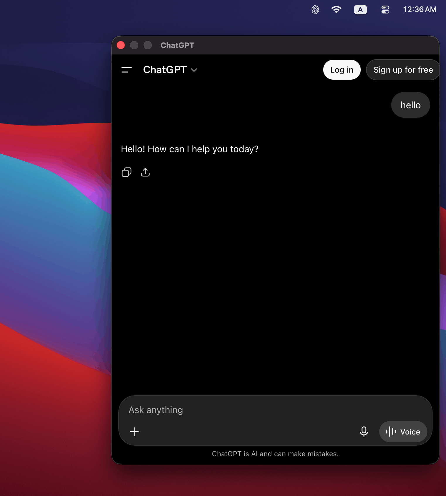

# macOS ChatGPT Overlay Bar

A lightweight macOS overlay that provides instant access to ChatGPT from anywhere on your desktop.

## Preview

  

## Quick Start

1. Download the latest release:
   https://github.com/ik190/macos-chatgpt-overlay-bar/releases/latest
2. Launch **ChatGPT Bar**.
3. The app will appear in your menu bar.

## Credits

This project is an independent client for ChatGPT.

**ChatGPT** and **OpenAI** are trademarks of OpenAI. All rights to the ChatGPT service, branding, and related intellectual property belong to OpenAI.
